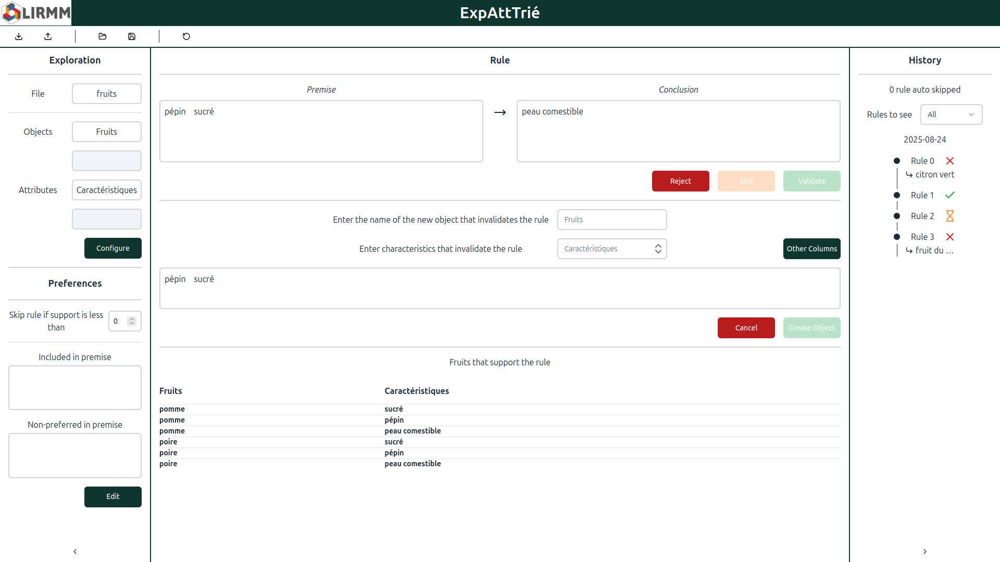

# ExpAttTrie (Attribute Exploration Web Application)

## Description
This project is a web application implementing the Attribute Exploration algorithm.

It was developed during my final-year internship at LIRMM (Laboratoire d'Informatique, de Robotique et de Microélectronique de Montpellier).

## Screenshots

## My role
I was responsible for:
- developing the graphical user interface
- implementing the algorithm

Additionally, I extended the algorithm to support:
- handling multidimensional data
- user preferences
- skipping questions

The goal was to provide a user-friendly interface to interact with the algorithm directly in the browser.

## Technologies used
- Svelte (Frontend)
- TypeScript
- Tailwind CSS
- Shadcn

## Link to the original repository
https://gite.lirmm.fr/rcampillo/expatttrie

https://rcampillo.lirmm.net/expatttrie/
